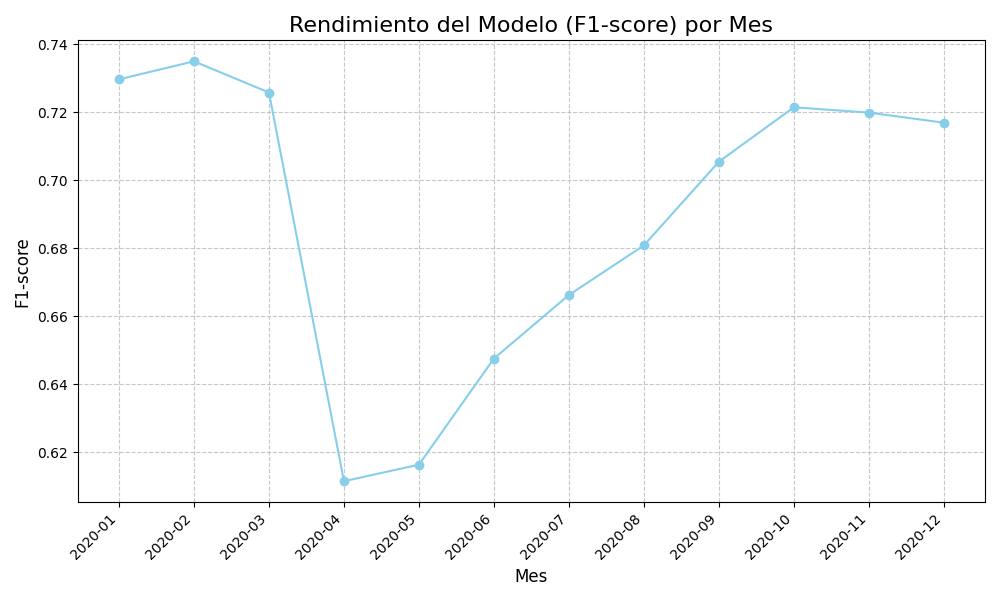
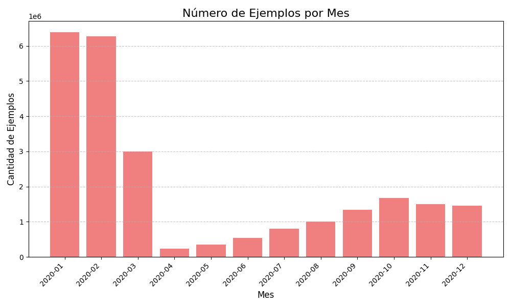

## Tarea 1 de Desarrollo de proyectos y productos de datos

### Objetivo General

Usando como base el código provisto en el siguiente notebook de Google Colab:

[Notebook Original de clasificación de Propinas para Viajes en Taxi en NYC](https://colab.research.google.com/drive/1CajYNrge3sAdV7Tc6YDvbB6fVqIP2qsJ "Acceder al notebook original en Google Colab")


Realizaremos lo siguiente:

- Construir un repositorio en GitHub que reproduzca el análisis del notebook, aplicando buenas prácticas de ingeniería de software y organización de proyectos de ciencia de datos vistas en el curso.

- Diseñar una estrategia para explicar el comportamiento distinto del modelo en diferentes meses del año, implementarla y analizar los resultados obtenidos.


## Instrucciones para configurar y ejecutar el proyecto:


- Clonar el repositorio

Abre tu terminal (o línea de comandos) y clona el repositorio a la ubicación deseada en tu máquina local. Luego, navega al directorio del proyecto:

```bash
git clone [https://github.com/pablo-mada/Tarea-1-DPyPD.git](https://github.com/pablo-mada/Tarea-1-DPyPD.git)
cd Tarea-1-DPyPD 
```

Se creará es siguiente esquema de directorios:

```
├── data/
│    ├── processed/    
│    └──  raw/   
├── models/
├── reports/
├── src/
    ├── __init__.py
│   ├── data/
│   │   └── dataset.py
│   ├── features/
│   │   └── build_features.py
│   ├── modeling/
│   │   ├── predict.py
│   │   └── train.py
│   ├── visualization/
│   │   └── plots.py
│   └── config.py
├── run_training.py
├── run_monthly_evaluation.py
└── requirements.txt
```

- Crea un entorno virtual (llamado `venv`)  

```bash
    python -m venv venv  
```   


- Activar el entorno virtual

```bash
    source venv/bin/activate  # macOS / Linux
    venv\Scripts\activate.bat  #Windows
 ```   

Verás (venv) al inicio de tu prompt de terminal si el entorno está activado correctamente.


- Instalar dependencias

Con el entorno virtual activado, instala todas las librerías de Python necesarias para el proyecto utilizando el archivo `requirements.txt`.

```bash
    pip install -r requirements.txt
 ```   


- Ejecutar el Entrenamiento del Modelo

El script de entrenamiento `run_training.py` se encargará de:

  - Descargar los datos crudos de enero de 2020.

  - Preprocesar los datos y generar las características necesarias.

  - Entrenar el modelo de clasificación de Random Forest.

Para ejecutar:

```bash
    python run_training.py
 ```   


- Ejecutar la evaluación mensual

Una vez que el modelo ha sido entrenado y guardado, puedes ejecutar el script de evaluación `run_monthly_evaluation.py`. Este script:

  - Cargará el modelo previamente entrenado.

  - Descargará y procesará los datos para cada mes de 2020.

  - Realizará predicciones y evaluará el rendimiento (F1-score) del modelo para cada mes.

  - Generará gráficos del rendimiento y del volumen de datos en el directorio reports/.

Para ejecutar:

```bash
  python run_monthly_evaluation.py
```   


## Visualización y análisis

A continuación, se muestran los gráficos del puntaje F1 del modelo y del tamaño de la muestra por mes:

### Puntaje F1 por mes


### Tamaño de la muestra por mes


Observamos que el número de ejemplos bajó en Marzo y luego creció paulatinamente, pero no llegando a los 6 millones de Enero y Febrero.


## Análisis crítico y explicación de resultados

- ¿El modelo mantiene un rendimiento consistente?

La siguiente tabla muestra los resultados de todo el año 2020, con las columnas `num_examples`(número de ejemplos) y `f1_score ` (puntuación F1). 

--- Tabla de Resultados de Evaluación Mensual ---
| month   |   num_examples |   f1_score |
|:--------|---------------:|-----------:|
| 2020-01 |        6382762 |   0.729691 |
| 2020-02 |        6276854 |   0.734988 |
| 2020-03 |        2995357 |   0.725813 |
| 2020-04 |         236611 |   0.611436 |
| 2020-05 |         346612 |   0.616309 |
| 2020-06 |         546843 |   0.647531 |
| 2020-07 |         796346 |   0.666227 |
| 2020-08 |        1001832 |   0.680824 |
| 2020-09 |        1334414 |   0.705431 |
| 2020-10 |        1673052 |   0.721457 |
| 2020-11 |        1501059 |   0.719903 |
| 2020-12 |        1453523 |   0.716935 |


En base a esto, el modelo no mantiene un rendimiento consistente a lo largo del tiempo. Al observar la columna f1_score en la tabla de resultados, se aprecia claramente una marcada variación.

  - Durante enero y febrero de 2020, el modelo exhibe un rendimiento alto y estable, con puntaje F1 de aproximadamente 0.730 y 0.735, respectivamente. Esto es esperable, ya que el modelo fue entrenado con datos de Enero y los patrones de Febrero son aún muy similares.

  - A partir de marzo de 2020, el puntaje F1 comienza a descender, y en abril de 2020, se observa una caída drástica hasta 0.611. Este es el punto más bajo del rendimiento del modelo.


  - Luego, entre mayo y diciembre de 2020, el putaje F1 muestra una lenta recuperación progresiva, pero nunca alcanza los niveles iniciales de enero y febrero, manteniéndose en el rango de 0.616 a 0.721.
    

Esta no consistencia en el rendimiento es un indicador claro de que el modelo se está viendo afectado por cambios en los datos.


- ¿Qué factores podrían explicar la variación en el desempeño?


La variación observada en el rendimiento del modelo a lo largo de 2020 puede explicarse principalmente por la irrupción y el desarrollo de la pandemia de COVID-19 y sus consecuentes efectos en el comportamiento social y económico, lo que se traduce en fenómenos de Data Drift y Concept Drift.

  - Caída drástica en el volumen de viajes: La columna `num_examples` es la clave aquí. En enero y febrero se observan más de 6 millones de viajes. En marzo, este número se reduce a casi 3 millones, y en abril y mayo, cae estrepitosamente a apenas 236 mil y 346 mil viajes, respectivamente. Esta disminución masiva refleja las estrictas medidas de confinamiento y la drástica reducción de la movilidad en la ciudad de Nueva York.

  - Data Drift (Deriva de datos): Los datos de abril y mayo son cualitativamente diferentes a los de enero.

    - Menos viajes por motivos de trabajo u ocio, y más viajes esenciales. Esto cambia las distribuciones de características como `pickup_hour` (menos picos en horas punta), `pickup_weekday` (menos distinción entre laborables y fin de semana), `trip_distance` (posiblemente más viajes cortos).

    - Las zonas que antes eran puntos calientes de actividad (distritos de negocios, atracciones turísticas, aeropuertos) vieron su tráfico reducido a mínimos, mientras que la actividad se concentró en zonas residenciales. El modelo, entrenado con los patrones de ubicación de una ciudad intensa, lucha por generalizar en una ciudad en cuarentena.

    - Es posible que la demografía o el propósito de los viajes de los pocos pasajeros restantes también hayan cambiado, impactando otras características numéricas.

  - Concept Drift (Deriva de concepto): La relación entre las características de un viaje y la probabilidad de una propina alta también pudo haber cambiado.

    La gente podría haber dado propina de manera diferente debido a la situación económica personal, o por un sentimiento de apoyo a los trabajadores esenciales que seguían en activo. Factores psicológicos y económicos externos, no capturados por las features existentes, alteraron la función que decide si se da una propina alta.

  - Lenta recuperación del rendimiento (Mayo-Diciembre 2020)

    A medida que las restricciones se fueron flexibilizando y la movilidad aumentó, se ve un incremento gradual en `num_examples`. El modelo muestra una ligera recuperación en su puntaje F1. Esto indica que los patrones de viaje y propinas comenzaron a normalizarse parcialmente o a estabilizarse en una nueva normalidad.


- ¿Qué acciones recomendarías para mejorar la robustez del modelo en el tiempo?

Para mejorar la capacidad del modelo de adaptarse a estos cambios y mantener un rendimiento aceptable, especialmente frente a fenómenos de drift tan severos, se recomiendan las siguientes acciones:

  - Re-entrenamiento periódico y automatizado

    Implementar un pipeline de ML que re-entrene automáticamente el modelo con los datos más recientes (los últimos 3-6 meses) de forma regular ( mensual o trimestral).

  - Monitoreo activo del rendimiento y del drift

    Un monitoreo proactivo permitiría detectar rápidamente la aparición de drift o una degradación del rendimiento, disparando alertas para una intervención manual o para el re-entrenamiento automático, antes de que el impacto en la predicción sea significativo.

  - Ingeniería de características consciente del Contexto

    Explorar y añadir características que capturen el contexto externo y temporal. Por ejemplo, indicadores de fases de la pandemia, variables económicas, features que capturen eventos anómalos o estacionales.


## Conclusión

Este proyecto ha logrado modularizar eficazmente el código original, mejorando su estructura, mantenibilidad y escalabilidad. Sin embargo, el análisis de rendimiento del modelo de clasificación de propinas en 2020 reveló un desafío crítico, Data and Concept Drift.

El modelo, entrenado con datos de enero de 2020, mostró una caída significativa en su puntaje F1 a partir de marzo de 2020, coincidiendo con el inicio de la pandemia de COVID-19 y la drástica reducción y cambio en los patrones de viajes en taxi. Esto demuestra que los modelos de Machine Learning no son estáticos, su rendimiento se degrada en entornos dinámicos donde las distribuciones de datos y las relaciones cambian.

Para asegurar la robustez del modelo a largo plazo, es crucial implementar un monitoreo continuo de su rendimiento y de la deriva de datos, así como establecer un pipeline de re-entrenamiento periódico con datos recientes. Estas prácticas son fundamentales para que el modelo se adapte a las nuevas realidades y mantenga su valor predictivo en un mundo en constante evolución.


